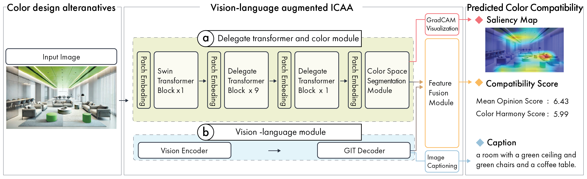

# ICAA17K Training Code

Official training code for Image Color Aesthetics Assessment using DAT (Deformable Attention Transformer) with Caption Features.

## Overview

This repository contains the training code for a multi-task aesthetic assessment model that predicts:
- **MOS (Mean Opinion Score)**: Overall aesthetic quality
- **Color Score**: Color harmony assessment

The model combines:
- **DAT (Deformable Attention Transformer)**: Visual feature extraction
- **GIT (Generative Image-to-Text)**: Caption feature extraction
- **Soft Histogram**: Color distribution features

## Model Architecture



The model architecture consists of:
1. **Visual Feature Extraction**: DAT backbone processes input images
2. **Caption Feature Extraction**: GIT model generates semantic features (1024-dim → 256-dim)
3. **Histogram Feature**: Soft histogram captures color distribution (216-dim)
4. **Feature Fusion**: Combines histogram and caption features
5. **Dual Heads**: Separate prediction heads for MOS and Color scores

## Project Structure

```
publish/
├── train.py                 # Main training script
├── option.py               # Training options and hyperparameters
├── config.py               # Model configuration management
├── dataset.py              # Dataset loader
├── util.py                 # Utility functions
├── requirements.txt        # Python dependencies
├── models/                 # Model implementations
│   ├── __init__.py
│   ├── build.py           # Model builder
│   ├── dat.py             # DAT model with caption features
│   ├── dat_blocks.py      # DAT building blocks
│   ├── SoftHistogram.py   # Soft histogram layer
│   └── caption_model_loader.py  # GIT model loader
├── configs/               # Model configuration files
│   ├── dat_base.yaml
│   ├── dat_tiny.yaml
│   ├── dat_small.yaml
│   └── dat_base_384.yaml
├── generativeimage2text/  # GIT model code (from Microsoft)
├── dataset/
│   └── ICAA17K/
│       ├── images/        # Place your images here
│       ├── 1train.csv     # Training split
│       └── 1test.csv      # Test split
├── pretrained_weights/    # Pretrained model weights
│   └── dat_base_checkpoint.pth
├── aux_data/
│   └── models/
│       └── GIT_LARGE_R_TEXTCAPS/
│           └── parameter.yaml
└── output/                # GIT model checkpoints
    └── GIT_LARGE_R_TEXTCAPS/
        └── snapshot/
            └── model.pt
```

## Installation

### 1. Clone the Repository

```bash
git clone https://github.com/microsoft/GenerativeImage2Text.git generativeimage2text
```

### 2. Install Dependencies

```bash
pip install -r requirements.txt
```

### 3. Download Pretrained Models

#### DAT Pretrained Weights

Download the DAT base model pretrained on ImageNet:

```bash
# Create directory
mkdir -p pretrained_weights

# Download DAT base checkpoint
wget https://github.com/LeapLabTHU/DAT/releases/download/v1.0/dat_base_in1k_224.pth \
     -O pretrained_weights/dat_base_checkpoint.pth
```

**Alternative DAT models:**
- DAT-Tiny: `https://github.com/LeapLabTHU/DAT/releases/download/v1.0/dat_tiny_in1k_224.pth`
- DAT-Small: `https://github.com/LeapLabTHU/DAT/releases/download/v1.0/dat_small_in1k_224.pth`

**Reference:** [DAT Official Repository](https://github.com/LeapLabTHU/DAT)

#### GIT Model Weights

The GIT (Generative Image-to-Text) model will be automatically downloaded via `azfuse` when you first run the training script.

**Manual download (optional):**

```bash
# Install azfuse
pip install git+https://github.com/microsoft/azfuse.git

# Create directory structure
mkdir -p aux_data/models/GIT_LARGE_R_TEXTCAPS
mkdir -p output/GIT_LARGE_R_TEXTCAPS/snapshot

# The model will auto-download on first run, or you can manually download from:
# https://github.com/microsoft/GenerativeImage2Text
```

**Reference:** [GenerativeImage2Text Repository](https://github.com/microsoft/GenerativeImage2Text)

**Available GIT models:**
- `GIT_LARGE_R_TEXTCAPS` (default, recommended)
- `GIT_BASE_TEXTCAPS`
- `GIT_LARGE_COCO`
- `GIT_BASE_COCO`

## Dataset Preparation

### ICAA17K Dataset

The ICAA17K (Image Color Aesthetics Assessment 17K) dataset is introduced in:

**"Thinking Image Color Aesthetics Assessment: Models, Datasets and Benchmarks"** (ICCV 2023)

**Download the dataset:**
- Dataset repository: [https://github.com/woshidandan/Image-Color-Aesthetics-and-Quality-Assessment](https://github.com/woshidandan/Image-Color-Aesthetics-and-Quality-Assessment)
- Follow their instructions to download ICAA17K dataset

### Dataset Structure

Your dataset CSV files should have the following format:

```csv
ID,MOS,color
image_001.jpg,7.5,8.2
image_002.jpg,6.3,7.1
...
```

- **ID**: Image filename
- **MOS**: Mean Opinion Score (0-10 scale)
- **color**: Color harmony score (0-10 scale)

### Organize Your Data

```bash
# Create dataset directory
mkdir -p dataset/ICAA17K/images

# Place your images in the images folder
cp /path/to/your/images/* dataset/ICAA17K/images/

# Place your CSV files
cp /path/to/1train.csv dataset/ICAA17K/
cp /path/to/1test.csv dataset/ICAA17K/
```

## Training Modes

This code supports two training modes for caption feature extraction:

### Mode 1: Real-time GIT Inference (Default)
- Extracts caption features during training
- **Use when**: First time training or testing

### Mode 2: Precomputed Features (Recommended for Production)
- Uses pre-extracted caption features from CSV files
- **Use when**: Final training runs or multiple experiments

### Using Precomputed Features

If you have precomputed caption features (e.g., from `/home/supercone/ICAA/git_result/GIT_LARGE_R_TEXTCAPS/normalized_result/`):

1. **Copy precomputed features to project:**
```bash
mkdir -p precomputed_features/GIT_LARGE_R_TEXTCAPS
cp -r /path/to/normalized_result precomputed_features/GIT_LARGE_R_TEXTCAPS/
```

2. **Enable precomputed mode in `models/dat.py`:**
```python
self.caption_model_loader = CaptionModelLoader(
    use_precomputed=True,  # Change to True
    precomputed_path='precomputed_features/GIT_LARGE_R_TEXTCAPS/normalized_result'
)
```

3. **Train normally:**
```bash
python train.py
```

### Extracting Your Own Features (Optional)

If you want to pre-extract features for your dataset, you can create a script similar to the original CSV extraction scripts. The features should be:
- Format: CSV files named `{image_id}_predictions.csv`
- Shape: (1, 1024) per image
- Normalized using global min/max values from the training set

**Note:** Precomputed features from `GIT_LARGE_R_TEXTCAPS` can be shared separately if needed.

## Training

### Basic Training

```bash
python train.py
```

### Custom Training Options

```bash
python train.py \
    --path_to_images ./dataset/ICAA17K/images \
    --path_to_save_csv ./dataset/ICAA17K \
    --experiment_dir_name ./experiments/my_experiment \
    --batch_size 16 \
    --num_epoch 40 \
    --init_lr 1e-5 \
    --gpu_id 0
```

### Training Arguments

- `--path_to_images`: Path to image directory
- `--path_to_save_csv`: Path to CSV files directory
- `--experiment_dir_name`: Directory to save experiments
- `--path_to_model_weight`: Path to DAT pretrained weights
- `--init_lr`: Initial learning rate (default: 1e-5)
- `--num_epoch`: Number of training epochs (default: 40)
- `--batch_size`: Batch size (default: 16)
- `--num_workers`: Number of data loading workers (default: 6)
- `--gpu_id`: GPU device ID (default: 0)

### Multi-Seed Training

The training script automatically runs experiments with 5 different random seeds (42, 123, 456, 789, 101112) for robust evaluation.

## Model Configuration

Edit `configs/dat_base.yaml` to modify model architecture:

```yaml
MODEL:
  TYPE: dat
  NAME: dat_base
  DAT:
    img_size: 224
    patch_size: 4
    num_classes: 2  # [MOS, Color]
    dims: [128, 256, 512, 1024]
    depths: [2, 2, 18, 2]
    ...
```

## Evaluation Metrics

The model is evaluated using:
- **SRCC (Spearman Rank Correlation Coefficient)**: Rank-based correlation
- **LCC (Linear Correlation Coefficient)**: Linear correlation
- **Accuracy**: Binary classification accuracy (threshold: 0.5)

Metrics are calculated separately for MOS and Color predictions, and averaged.

## Monitoring Training

TensorBoard logs are automatically saved:

```bash
tensorboard --logdir experiments/your_experiment_name/logs
```

## Output

### Saved Models

Best models are automatically saved as:
```
experiments/your_experiment_name/best_model_epoch_{epoch}_srcc_{srcc}_acc_{acc}.pth
```

### Training Logs

- Console output with progress bars
- TensorBoard logs in `experiments/*/logs/`
- Per-epoch metrics: train loss, validation loss, SRCC, LCC, accuracy

## Citation

If you use this code or the ICAA17K dataset, please cite:

```bibtex
@article{hethinking,
  title={Thinking Image Color Aesthetics Assessment: Models, Datasets and Benchmarks},
  author={He, Shuai and Ming, Anlong and Yaqi, Li and Jinyuan, Sun and ShunTian, Zheng and Huadong, Ma},
  journal={ICCV},
  year={2023}
}

@inproceedings{dat2022,
  title={Vision Transformer with Deformable Attention},
  author={Xia, Zhuofan and Pan, Xuran and Song, Shiji and Li, Li Erran and Huang, Gao},
  booktitle={CVPR},
  year={2022}
}

@inproceedings{git2022,
  title={GIT: A Generative Image-to-text Transformer for Vision and Language},
  author={Wang, Jianfeng and Yang, Zhengyuan and Hu, Xiaowei and Li, Linjie and Lin, Kevin and Gan, Zhe and Liu, Zicheng and Liu, Ce and Wang, Lijuan},
  booktitle={arXiv preprint arXiv:2205.14100},
  year={2022}
}
```

## Troubleshooting

### CUDA Out of Memory

Reduce batch size:
```bash
python train.py --batch_size 8
```

### GIT Model Download Issues

If azfuse fails, manually set environment variable:
```bash
export AZFUSE_TSV_USE_FUSE=1
python train.py
```

### Missing Dependencies

```bash
pip install --upgrade -r requirements.txt
```

## License

This code is released under the MIT License. See LICENSE file for details.

The DAT model and GIT model have their own licenses:
- DAT: Apache-2.0 License
- GIT: MIT License

## Acknowledgments

This code is based on and builds upon the following excellent works:

- **[ICAA: Image Color Aesthetics Assessment](https://github.com/woshidandan/Image-Color-Aesthetics-and-Quality-Assessment)** - Original ICAA17K dataset and baseline models (ICCV 2023)
- [DAT: Vision Transformer with Deformable Attention](https://github.com/LeapLabTHU/DAT) - Backbone architecture
- [GenerativeImage2Text (GIT)](https://github.com/microsoft/GenerativeImage2Text) - Caption feature extraction
- [timm: PyTorch Image Models](https://github.com/rwightman/pytorch-image-models) - Model utilities

## Contact

For questions or issues, please open an issue on GitHub.
